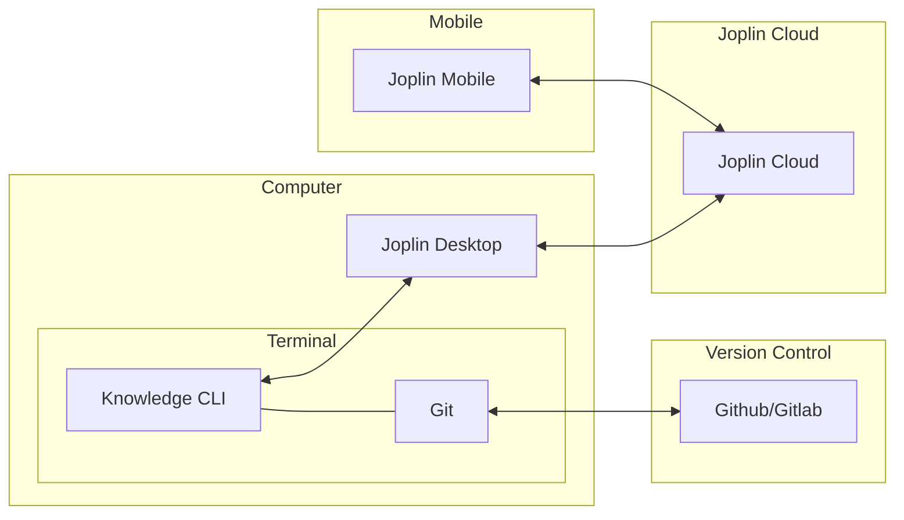
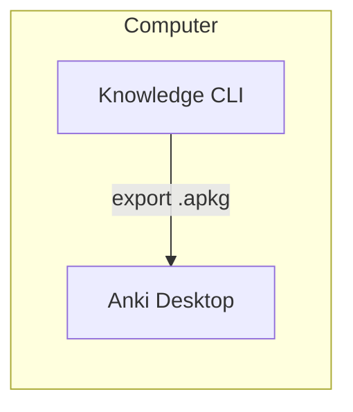

# Kl (Knowledge) - Zettelkasten CLI Tool

Knowledge is a command-line tool for managing [markdown-based notes](./docs/plain-text-importance.md) in a [Zettelkasten](./docs/zettlekasten.md)-style system.

Compared to other [related projects](#related-projects), Knowledge offers native integration with [Joplin](https://github.com/laurent22/joplin) and [Anki](https://github.com/ankitects/anki) for spaced repetition learning.

This provides:
- Note availability on smartphones (read and write access)
- Proper version control on computer
- Spaced repetition learning through Anki

For naming and file organization, see the [Conventions Guide](./docs/conventions.md).

## System Architecture

Knowledge operates as a local-first system. The cloud integration is the "icing on the cake".

On your computer, it manages markdown notes in your filesystem (creation, research, deletion, etc.) and provides two distinct integrations:

- **Bidirectional synchronization** (import and export) with [Joplin](https://github.com/laurent22/joplin) Desktop
- **Export** to [Anki](https://apps.ankiweb.net/) via `.apkg` packages

### Bidirectional synchronization with [Joplin](https://github.com/laurent22/joplin)

The [Joplin](https://github.com/laurent22/joplin) integration enables bidirectional synchronization between your local Knowledge notes and [Joplin](https://github.com/laurent22/joplin)'s ecosystem, providing access across all your devices.



### Export to [Anki](https://apps.ankiweb.net/)

The [Anki](https://apps.ankiweb.net/) integration enables one-way export of notes for spaced repetition learning.




## Dependencies

### Required Tools

- **[Rg](https://github.com/BurntSushi/ripgrep)**: For fast grep search

### Optional Tools

- **[Anki](https://apps.ankiweb.net/)**: For spaced repetition learning (`anki export` command)
- **[Flameshot](https://github.com/flameshot-org/flameshot)**: For screenshots (`image` command)
- **[Fzf](https://github.com/junegunn/fzf)**: For interactive fuzzy finding
- **[Inkscape](https://inkscape.org/)**: For diagrams (`schema` command)
- **[Joplin](https://github.com/laurent22/joplin)**: For cross-platform synchronization

## Installation

After cloning the repo execute the following command:

```bash
./install.sh
```

This will:

- Build the knowledge binary and install it to `/usr/local/bin/kl`
- Generate and install man pages
- Set up bash completion
- Make the `kl` command available system-wide

Then in [Joplin](https://github.com/laurent22/joplin), enable [Web Clipper](https://joplinapp.org/help/apps/clipper/#using-the-web-clipper-service):

```
Tools → Options → Web Clipper → Enable Web Clipper
```

## Usage

For detailed usage examples and workflows, see [Usage Guide](./docs/usage.md).

## Roadmap

See the [Roadmap](./docs/roadmap.md) for planned features and improvements.

## Related Projects

- [Zk](https://github.com/zk-org/zk)
- [Neuron](https://github.com/srid/neuron)
- [Emanote](https://emanote.srid.ca/)
- [Sirupsen's zk](https://github.com/sirupsen/zk)
- [Zk-spaced](https://github.com/matze/zk-spaced)
