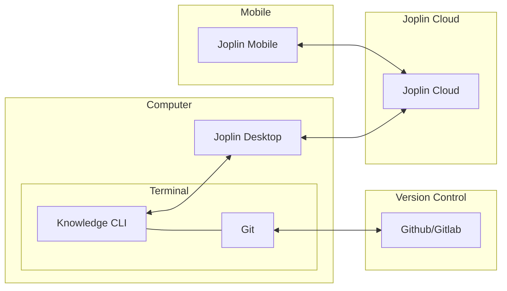
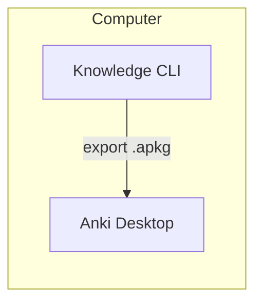

# System Architecture

Knowledge operates as a local-first system. The cloud integration is the "icing on the cake".

On your computer, it manages markdown notes in your filesystem (creation, research, deletion, etc.) and provides two distinct integrations:

- **Bidirectional synchronization** (import and export) with [Joplin](https://github.com/laurent22/joplin) Desktop
- **Export** to [Anki](https://apps.ankiweb.net/) via `.apkg` packages

## Bidirectional synchronization with [Joplin](https://github.com/laurent22/joplin)

The [Joplin](https://github.com/laurent22/joplin) integration enables bidirectional synchronization between your local Knowledge notes and [Joplin](https://github.com/laurent22/joplin)'s ecosystem, providing access across all your devices.

## Export to [Anki](https://apps.ankiweb.net/)

The [Anki](https://apps.ankiweb.net/) integration enables one-way export of notes for spaced repetition learning.

