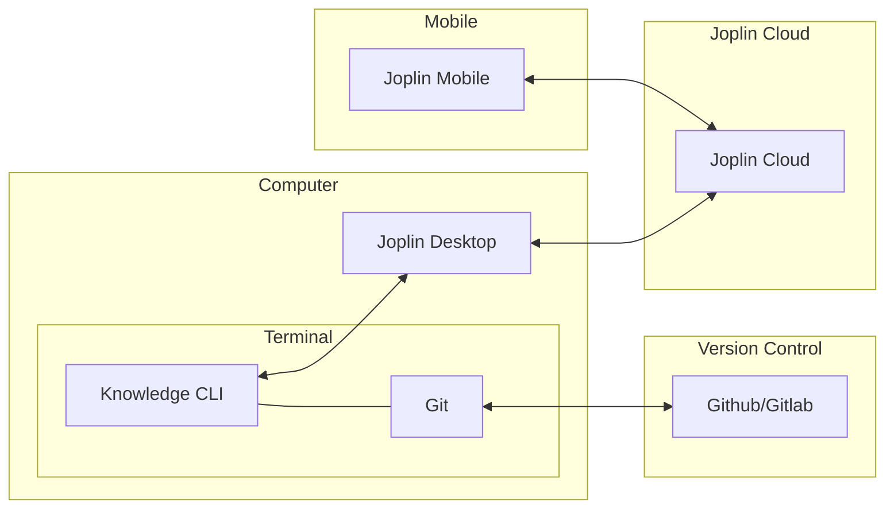
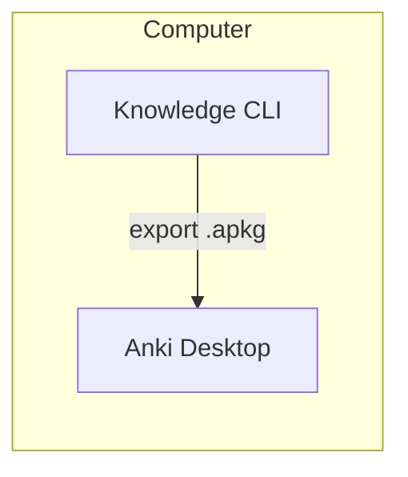

# System Architecture

Knowledge operates as a local-first system. The cloud integration is the "icing on the cake".

On your computer, it manages markdown notes in your filesystem (creation, research, deletion, etc.) and provides two distinct integrations:

- **Bidirectional synchronization** (import and export) with [Joplin](https://github.com/laurent22/joplin) Desktop
- **Export** to [Anki](https://apps.ankiweb.net/) via `.apkg` packages

## Bidirectional synchronization with [Joplin](https://github.com/laurent22/joplin)

The [Joplin](https://github.com/laurent22/joplin) integration enables bidirectional synchronization between your local Knowledge notes and [Joplin](https://github.com/laurent22/joplin)'s ecosystem, providing access across all your devices.

```mermaid
graph LR
    subgraph Version_Control[Version Control]
        GL[Github/Gitlab]
    end

    subgraph Computer
        subgraph Terminal
            K[Knowledge CLI]
            G[Git]
            K --- G
        end
        JD[Joplin Desktop]
        K <--> JD
    end

    subgraph Joplin_Cloud[Joplin Cloud]
        JC[Joplin Cloud]
    end

    subgraph Mobile
        JM[Joplin Mobile]
    end

    JD <--> JC
    JM <--> JC
    G <--> GL
```

## Export to [Anki](https://apps.ankiweb.net/)

The [Anki](https://apps.ankiweb.net/) integration enables one-way synchronization of notes for spaced repetition learning. Exported decks are imported into the Anki collection automatically using the official [anki Python library](https://dev-docs.ankiweb.net/en/latest/api-python.html) (Anki must be closed during import). The `anki_export_<deck_name>` files are the source of truth: cards whose note left the deck file or disappeared from `$K_DIR` are removed from the collection, so a deleted note never survives as a card. That removal runs at the end of `anki export`, and `anki clean` runs it on its own when the import could not.

```mermaid
graph LR
    subgraph Computer
        K[Knowledge CLI]
        AD[Anki Desktop]
        K -->|export .apkg| AD
    end
```
